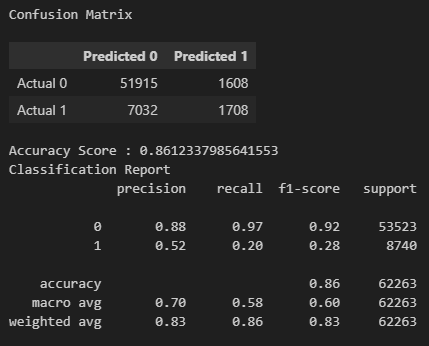
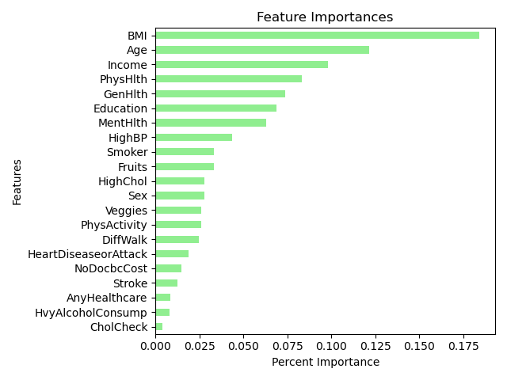
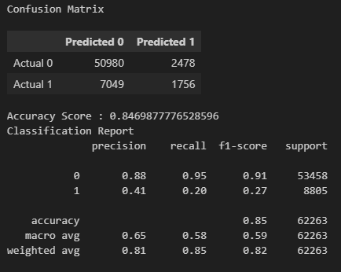
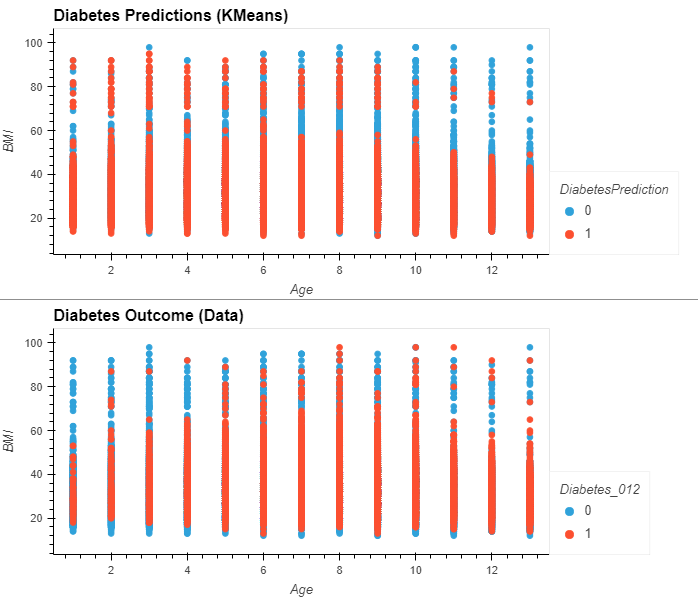
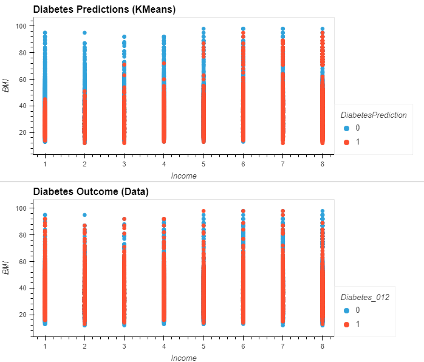
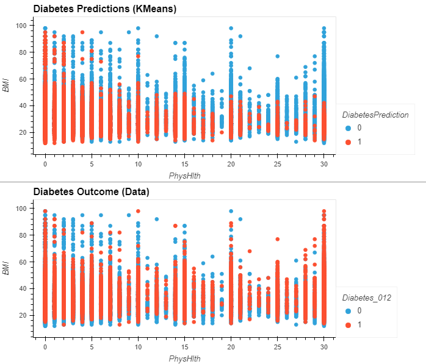

# diabetes_prediction
Project 4

### PROJECT OVERVIEW

This project will aim to identify the most crucial factors in predicting diabetes as well as using said factors to establish a more accurate predictive model. The dataset for this project covers 21 influential factors for determining if a person is at risk for diabetes. These twenty-one factors will be tested to determine the correlation between the factors and a person’s propensity towards diabetes.  Each relevant discovery will be visualized accordingly.

The original dataset can be found at this site https://www.kaggle.com/code/encode0/diabetes-prediction-and-risk-factors-evaluation/input?select=diabetes_012_health_indicators_BRFSS2015.csv

____________________________________________________________________________________________

### TEAM MEMBERS

* Leah Latham
* Tiffany Conrad
* Adrian Sandoval
* Damla Duman
* Daniel Meyerowitz

____________________________________________________________________________________________

### CONTENTS IN THIS REPOSITORY

* Resources folder containing the following:
    * Original csv file
    * Cleaned csv file
    * CDC codebook pdf for column identification
* Images Folder containing screenshots of analysis steps, charts, and graphs
* cleaning.ipynb - Jupyter Notebook file containing cleaning steps
* analysis.ipynb - Jupyter Notebook file containing analysis steps
* Diabetes_Prediction_Visuals.twbx - Tableau File

____________________________________________________________________________________________

### PROJECT OUTLINE

* Identify risk factors with feature_importance, KerasTuners, and neural networks for a baseline
* Upload modified dataframe to SQL 
* Optimize the model and use SKLearn to compare features
* Create vizualizations utilizing Tableau

____________________________________________________________________________________________

### ANALYSIS

1. SPARK IMPORT

We started by uploading the cleaned data via spark and converted to a Pandas DataFrame as seen below.

2. Profile Report (Ydata Profiling)

We created a summary statistics report using the cleaned data as seen below.  This provided a lot of information about the columns and correlation between them.

2. TABLEAU

We used Tableau to visualize the cleaned data and compare it to the machine learning models discussed in the next section.

The Tableau workbook can be found at this site https://public.tableau.com/app/profile/leah.latham/viz/Diabetes_Prediction_Visuals_17000126037780/DiabetesData?publish=yes

3. MACHINE LEARNING
    * Neural Networks/KerasTuner  
        We ran four neural network models utilizing different parameters and units with different activation sequences.  We started with the original uncleaned dataset for model #1 and #2, with model #2 dropping a column.  Model #3 and model #4 utilized the cleaned dataset with model #4 utilizing KerasTuner to identify the best parameters.

    * Random Forests  
        We also ran two Random Forest models.  The first utilized all 21 features from the cleaned dataset.  We then used this model to identify Feature Importances.  Then we chose only the top 10 features from the Feature Importances analysis for the second Random Forest model.

    * KMeans
        We ran three KMeans models to compare the top four features, looking at BMI-age, BMI-income, and BMI-physical health.

____________________________________________________________________________________________

### RESULTS

* Neural Networks
    1. Model 1 - baseline uncleaned data

        

        

    2. Model 2 - baseline uncleaned data with one dropped column `NoDocbcCost`

        
        
        

    3. Model 3 - cleaned data

        
        
        

    4. Model 4 - cleaned data with optimized KerasTuner model

        
        
        
         

* Random Forests
    1. Model 1 - clean data with all features - shows confusion matrix and accuracy report

        

    2. Feature Importances based on Model 1

        

    3. Model 2 - clean data with top 10 features based on Feature Importances - shows confusion matrix and accuracy report

        We lost around 1.5% accuracy when limiting to top ten features.

        
         

* KMeans
    1. BMI and age comparison

        

    2. BMI and income comparison

        

    3. BMI and physical health comparison

        

____________________________________________________________________________________________

### SUMMARY

* Starting with the original uncleaned data, we saw 32% improvement in accuracy for a final accuracy score of 86.4% in the optimized neural network models. This was accomplished by removing the pre-diabetes category, converting all features to integers, and scaling the data. Of note, there were significant differences in accuracy when comparing `0 - no diabetes` (~92% accuracy) with `1 - diabetes` (~28% accuracy) using Random Forests. This may be impacted by multiple factors, including the difference in volume in the training and testing data, gestational diabetes cases being included in the `0 - no diabetes` columns, and multiple columns containing imbalanced responses. We that used Feature Importances to identify the best feattures. We also utilized KMeans to visualize 

We utilized Tableau to visualize the four most influential features in the dataset (BMI, age, income, and physical health).  During this analysis, we noticed both BMI and age had a positive correlation - as age and BMI increase, the risk for diabetes also increases.  Income had a negative correlation, with an increased risk of diabetes occuring below the national poverty line (~$25,000) and decreasing as income increased.  Physical health data was heavily skewed with 0 days unwell, so we removed it from the visualization to better illustrate the comparison between the rest of the month.  This showed 30 days unwell had the highest percentage of patients with diabetes at (30.4% population)

As mentioned earlier, gestational diabetes was included in the `no diabetes` category but was not identified so we were unable to isolate those and determine its impact on the data.  Overall accuracy for the diabetes population was low (~28%).  This may have been impacted by undiagnosed cases, which comprise approximately 20% of the diabetic population. Since this dataset was gathered via survey, undiagnosed patients may have answered as `0 - no diabetes` when the did have diabetes.  This would make it more difficult for the model to accurately identify cases.

This dataset offered a good overall baseline for diabetes identification, but it lacked additional factors that may have allowed for optimization.  We would like to have seen data on lab values, family history, medications, and more detailed diet information.
____________________________________________________________________________________________

### RESOURCES

* Original dataset source : https://www.kaggle.com/code/encode0/diabetes-prediction-and-risk-factors-evaluation/input?select=diabetes_012_health_indicators_BRFSS2015.csv
