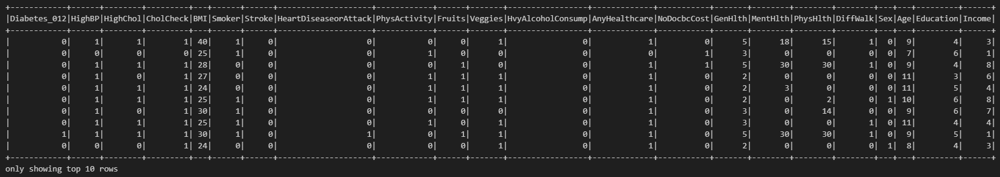
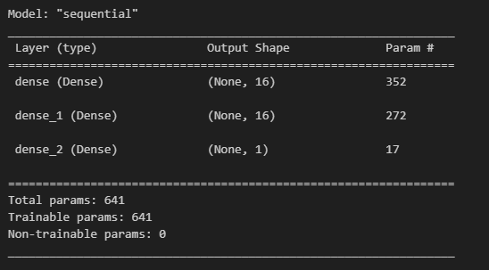

# diabetes_prediction
Project 4

### PROJECT OVERVIEW

This project will aim to identify the most crucial factors in predicting diabetes as well as using said factors to establish a more accurate predictive model. The dataset for this project covers 21 influential factors for determining if a person is at risk for diabetes. These twenty-one factors will be tested to determine the correlation between the factors and a person’s propensity towards diabetes.  Each relevant discovery will be visualized accordingly.

The original dataset can be found at this site https://www.kaggle.com/code/encode0/diabetes-prediction-and-risk-factors-evaluation/input?select=diabetes_012_health_indicators_BRFSS2015.csv

____________________________________________________________________________________________

### TEAM MEMBERS

* Leah Latham
* Tiffany Conrad
* Adrian Sandoval
* Damla Duman
* Daniel Meyerowitz

____________________________________________________________________________________________

### CONTENTS IN THIS REPOSITORY

* Resources folder containing the following:
    * Original csv file
    * Cleaned csv file
    * CDC codebook pdf for column identification
* Images Folder containing screenshots of analysis steps, charts, and graphs
* cleaning.ipynb - Jupyter Notebook file containing cleaning steps
* analysis.ipynb - Jupyter Notebook file containing analysis steps
* Diabetes_Prediction_Visuals.twbx - Tableau File

____________________________________________________________________________________________

### PROJECT OUTLINE

* Identify risk factors with feature_importance, KerasTuners, and neural networks for a baseline
* Upload modified dataframe to SQL 
* Optimize the model and use SKLearn to compare features
* Create vizualizations utilizing Tableau

____________________________________________________________________________________________

### ANALYSIS

1. SPARK IMPORT

We started by uploading the cleaned data via spark and converted to a Pandas DataFrame as seen below.

2. Profile Report (Ydata Profiling)

We created a summary statistics report using the cleaned data as seen below.  This provided a lot of information about the columns and correlation between them.

2. TABLEAU

We used Tableau to visualize the cleaned data and compare it to the machine learning models discussed in the next section.

The Tableau workbook can be found at this site https://public.tableau.com/app/profile/leah.latham/viz/Diabetes_Prediction_Visuals_17000126037780/DiabetesData?publish=yes

3. MACHINE LEARNING
    * Neural Networks/KerasTuner  
        We ran four neural network models utilizing different parameters and units with different activation sequences.  We started with the original uncleaned dataset for model #1 and #2, with model #2 dropping a column.  Model #3 and model #4 utilized the cleaned dataset with model #4 utilizing KerasTuner to identify the best parameters.

    * Random Forests  
        We also ran two Random Forest models.  The first utilized all 21 features from the cleaned dataset.  We then used this model to identify Feature Importances.  Then we chose only the top 10 features from the Feature Importances analysis for the second Random Forest model.

    * KMeans
        We ran three KMeans models to compare the top four features, looking at BMI-age, BMI-income, and BMI-physical health.

____________________________________________________________________________________________

### RESULTS

* Neural Networks
    1. Model 1 - baseline uncleaned data

        

        

    2. Model 2 - baseline uncleaned data with one dropped column `NoDocbcCost`

        
        
        

    3. Model 3 - cleaned data

        
        
        

    4. Model 4 - cleaned data with optimized KerasTuner model

        
        
        

____________________________________________________________________________________________

### SUMMARY

* in progress...

____________________________________________________________________________________________

### RESOURCES

* Original dataset source : https://www.kaggle.com/code/encode0/diabetes-prediction-and-risk-factors-evaluation/input?select=diabetes_012_health_indicators_BRFSS2015.csv
